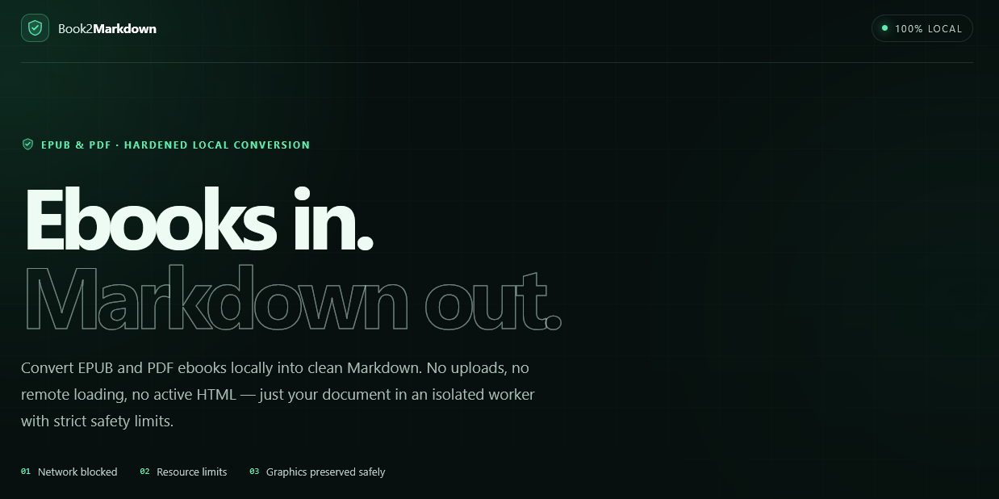

# Book2Markdown

**Convert EPUB, FB2 and PDF ebooks to clean Markdown — locally, with untrusted input in mind.**

Book2Markdown is a browser-based converter with no backend and no upload. The document
stays on the device, parsing runs in a disposable worker, and the production build cannot
make network connections.



## Supported formats

| Input | Output | Notes |
|---|---|---|
| EPUB 2/3 | General Markdown bundle plus synchronized LLM package | Preserves signature-checked raster images and allowlist-sanitized SVG at their reading positions |
| FictionBook 2 (`.fb2`, `.fb2.zip`) | Same synchronized book package as EPUB | Preserves sections, notes, cover art and embedded signature-checked or sanitized images at their reading positions |
| PDF | Synchronized visual PDF and page-separated Markdown | Re-renders whole pages so raster images, vector graphics, tables and layout stay together; original active objects are not copied |

Scanned PDF pages remain visible in the visual companion, but they need OCR before they can
produce Markdown text. PDF is a layout format, so complex columns, tables and reading order may
still require manual Markdown cleanup.

## Start the app

Install [Node.js 24](https://nodejs.org/) and run:

```powershell
git clone https://github.com/leshxt/Book2Markdown.git
cd Book2Markdown
npm install
npm run dev
```

Open the local URL printed by Vite, normally `http://localhost:5173`.

For a production-like run:

```powershell
npm run build
npm run preview
```

The static build is written to `dist/`. Keep the generated Content Security Policy intact
when hosting it.

## What the export contains

EPUB and FB2 exports contain:

- `book.md` with the complete book and stable `FIG-xxxx` markers at the original image positions;
- one Markdown file per text or visual spine item under `chapters/`;
- signature-checked PNG, JPEG, GIF and WebP assets under `assets/`, named with matching figure IDs;
- sanitized standalone and inline SVG assets, including safe local raster references;
- a synchronized multimodal package under `notebooklm/`;
- `SECURITY-REPORT.md` with enforced limits and removed content.

PDF exports contain `notebooklm/document.visual.pdf`, matching `PAGE-xxxx` sections in
`document.md`, import guidance and the security report. The visual PDF is a new document made
only from locally rendered JPEG pages. It preserves the complete visible page rather than trying
to guess which embedded objects count as images. Original links, forms, file attachments,
annotations, scripts and PDF object structures are not copied.

## NotebookLM and multimodal LLMs

For NotebookLM, start with **`notebooklm/book.sanitized.epub` only**. It is the primary source and
already contains the complete text plus the actual sanitized graphics at matching `FIG-xxxx`
positions without copying the source ebook's scripts, forms, remote resources or original markup.
Using one source avoids duplicate passages and competing citations.

`notebooklm/book.md` is an optional text-only fallback. Add it only when EPUB text retrieval or
citations are incomplete, or when another target tool does not accept EPUB. It provides normalized
heading levels, metadata, a table of contents, retained cross-chapter references and figure markers.
Do not select both sources by default.

`FIGURE-INDEX.md` maps every graphic to its chapter, caption or alt text, nearby text and safe
asset. Graphics present in the EPUB or FB2 package but absent from the readable body are retained in a
clearly labeled appendix instead of disappearing silently. Declared EPUB navigation documents are
excluded from the canonical LLM text to avoid duplicate table-of-contents boilerplate; arbitrary
copyright or front-matter content is not heuristically deleted.

NotebookLM officially accepts Markdown, EPUB and several standalone raster image formats. If it
fails to inspect an embedded raster figure, add the matching PNG, JPEG, GIF or WebP file from
`assets/` as a separate image source. Standalone SVG is not listed as supported, so sanitized SVG
remains available through the companion EPUB. Do not also upload `chapters/` unless duplicate text
is intentional. Alt text and captions improve retrieval but do not replace inspection of the
actual pixels.

For PDF, start with **`notebooklm/document.visual.pdf` only**. Every page is flattened to passive
pixels, which keeps photographs, diagrams, vector art, tables and their exact placement together.
`PAGE-0001` in `document.md` maps to page 1 in that visual PDF. Add `document.md` only if the target
model's text retrieval from the visual PDF is incomplete; using both by default can duplicate
passages and citations.

`LLM-SAFETY-REPORT.md` flags a small set of common instruction-like patterns. It never deletes the
book passage: legitimate fiction, security writing or quoted prompts must remain intact.

## Security model

Book2Markdown treats every input as hostile:

- all parsing happens in a dedicated worker with a 120-second watchdog;
- the production CSP includes `connect-src 'none'`;
- ZIP paths, entry counts, sizes and compression ratios are checked before EPUB or compressed-FB2 extraction;
- XML entities and internal DTD subsets are rejected; inert legacy XHTML doctypes are stripped;
- FB2 uses an XML-encoding allowlist, bounded Base64 decoding and the same raster/SVG image checks as EPUB;
- PDF.js receives local bytes only, with fetching, XFA, system fonts, browser image decoders and WASM disabled;
- PDF annotations are disabled during page rendering, and a new PDF is built only from bounded JPEG page images;
- untrusted HTML or Markdown is never rendered in the application;
- SVG scripts, event handlers, remote or embedded sources, active elements and unsafe styles are removed;
- the visual companion EPUB is rebuilt from passive generated XHTML and already-sanitized assets,
  rather than copying source HTML;
- only passive Markdown/XHTML, signature-checked raster files and allowlist-sanitized SVG leave the converter.

See [SECURITY.md](SECURITY.md) for the threat model and
[docs/SECURITY-HARDENING.md](docs/SECURITY-HARDENING.md) for the changes compared with the
original project. Future format and OCR ideas are tracked in [docs/ROADMAP.md](docs/ROADMAP.md).

“Hardened” is not an absolute security guarantee. Keep the browser updated; use a disposable
browser profile or virtual machine for exceptionally hostile material.

## Development

```powershell
npm ci
npm run test
npm run build
npm run audit
```

`npm run verify` runs all gates. CI uses SHA-pinned GitHub Actions, and Dependabot checks npm
and workflow dependencies weekly.

## Project history

Book2Markdown is an independent rewrite inspired by
[`uxiew/epub2MD`](https://github.com/uxiew/epub2MD). The original MIT notice is preserved in
[THIRD_PARTY_NOTICES.md](THIRD_PARTY_NOTICES.md). PDF parsing/rendering is powered by Mozilla
PDF.js under Apache-2.0; passive PDF rebuilding uses pdf-lib under MIT.

## License

MIT for the new project code. Third-party components retain their respective licenses.
