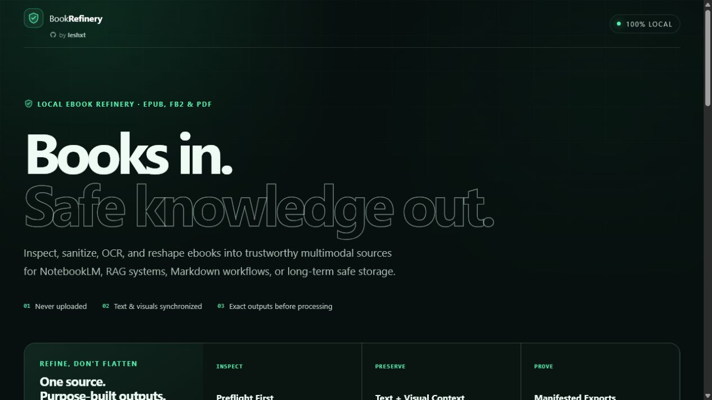

# BookRefinery


**Safe ebook preparation for NotebookLM, RAG, Markdown, and long-term archives - local,
multimodal, and built for untrusted input.**

BookRefinery is a local browser and native desktop app by [`leshxt`](https://github.com/leshxt). It
inspects, safely repairs recoverable ebook containers, sanitizes content, recovers missing PDF text,
and restructures EPUB, FictionBook 2, and PDF ebooks without uploading them. Searchable text remains
connected to essential graphics and page visuals; scripts, remote resources, forms, attachments, and
active markup do not enter the prepared output.



## Download

| Platform | Direct download |
|---|---|
| Windows 10/11 (x64) | [BookRefinery installer (`.exe`)](https://github.com/leshxt/BookRefinery/releases/latest/download/BookRefinery-Windows-x64.exe) |
| Linux (x86_64) | [Portable AppImage](https://github.com/leshxt/BookRefinery/releases/latest/download/BookRefinery-Linux-x86_64.AppImage) |
| Debian / Ubuntu (amd64) | [Debian package (`.deb`)](https://github.com/leshxt/BookRefinery/releases/latest/download/BookRefinery-Linux-amd64.deb) |

These links always download the assets from the
[latest stable GitHub release](https://github.com/leshxt/BookRefinery/releases/latest). The community
packages are currently unsigned, so Windows or Linux may ask for confirmation before installation.

## What it prepares

| Input | Preserved output | Structure |
|---|---|---|
| EPUB 2/3 | Passive sanitized EPUB, Markdown, verified raster images, allowlist-sanitized SVG | Reading order, chapters, metadata, stable `FIG-xxxx` references |
| FictionBook 2 (`.fb2`, `.fb2.zip`) | The same multimodal book contract as EPUB | Sections, notes, cover art, embedded graphics |
| PDF | Page-faithful sanitized PDF, rebuilt searchable text layer, Markdown | Stable `PAGE-xxxx` files, detected headings and columns, optional outline sections |

Preflight runs in a disposable worker before conversion. It reports format, title, page or chapter
count, graphics, text coverage, decompressed size, warnings, repair availability, and whether local
OCR is recommended. Up to 100 books can then be queued and processed sequentially, each with
independent limits and cancellation. Sequential conversion keeps large PDF batches from exhausting
memory.

## Selectable outputs and presets

NotebookLM, RAG, Markdown Workspace, and Safe Archive are shortcut buttons. After choosing one, every
output group can still be enabled or disabled independently:

| Output group | Best for | Contains |
|---|---|---|
| Sanitized visual source | NotebookLM, multimodal chat, visual verification | A passive EPUB or high-quality PDF with selectable text aligned to the original figures/pages |
| Complete Markdown | Obsidian, editing, Git, simple LLM uploads | One complete `.md` file with stable chapter, page, and figure identifiers |
| Retrieval chunks | RAG, embeddings, knowledge bases | `chapters/*.md` or `pages/PAGE-*.md`, plus PDF outline sections when available |
| Visual assets | Visual RAG and figure auditing | Sanitized EPUB/FB2 images plus a figure-to-context index; for PDF, the page-faithful sanitized PDF |

Generated file and ZIP names come from the analyzed book title, for example
`The Invincible Company.sanitized.pdf`, `The Invincible Company.md`, and
`The Invincible Company-notebooklm.zip`. Every bundle also contains title-based security and
SHA-256 manifest files.

For NotebookLM, the sanitized EPUB or PDF remains the recommended single-source upload. Select
Complete Markdown only as a fallback when the target tool cannot use the visual source or text
retrieval is insufficient; uploading both by default can create duplicate passages and citations.

## Safe ebook repair

Damaged EPUB and compressed FB2 files first pass the strict archive reader. Only structurally broken
ZIP containers enter the bounded repair path; files already rejected for unsafe paths, excessive
sizes, suspicious compression ratios, encryption, or other policy violations never bypass those
checks. BookRefinery can reconstruct verified ZIP directories, missing EPUB `mimetype` and
`container.xml` records, safe manifest media types, and an otherwise missing reading order when the
result is unambiguous.

Every recovered entry must still pass path, size, compression, decompression, and CRC checks. The
original file is never overwritten. The result includes a title-based repair report and, when the
container can be rebuilt without changing package semantics, a repaired source copy. If an incomplete
trailing entry must be omitted or reading order must be inferred, the app labels the result as
salvage instead of silently presenting it as complete. Ambiguous repairs are refused.

## Automatic full-book text recovery

OCR is enabled by default and only runs on PDF pages without an extractable text layer. It can be
disabled before conversion when speed matters more than recovering scanned text. English and German
language data, the Tesseract WebAssembly runtime, and its worker are bundled with the application;
no model or language file is downloaded from a CDN. OCR text is written into the normal Markdown
and position-aligned selectable PDF layers, so it does not become a disconnected duplicate source.

Preflight checks every PDF page and reports the exact number that needs OCR. Ordinary books are
processed completely; unusually large jobs remain bounded to 500 textless pages, 1.5 billion rendered
pixels in total, 4.5 million pixels per page, and a separate 60-minute worker timeout. Recognition is
probabilistic: verify important passages against the preserved page image. The security report records
OCR pages and any limit or initialization warning.

## Password PDFs

When a PDF needs a password, BookRefinery asks for it next to that file and retries the isolated
preflight locally. Incorrect passwords can be retried. The password stays in volatile memory only,
is sent solely to that file's disposable worker, and is cleared after the job; it is never written to
logs, reports, manifests, or output files. Prepared PDF and Markdown outputs are newly built and are
not password-protected.

Before OCR, BookRefinery also repairs incomplete embedded PDF font maps from their local glyph names.
This recovers deterministic character mappings such as stylistic alternate letters without guessing
or rasterizing otherwise extractable text. The generated security report records repaired pages and
character counts.

## Start the app

Install [Node.js 24](https://nodejs.org/) and run:

```powershell
git clone https://github.com/leshxt/BookRefinery.git
cd BookRefinery
npm install
npm run dev
```

Open the local URL printed by Vite, normally `http://localhost:5173`.

### Install as a desktop app

Native packages are published on the
[GitHub Releases page](https://github.com/leshxt/BookRefinery/releases):

- **Windows:** download `BookRefinery-Windows-x64.exe`.
- **Linux:** download `BookRefinery-Linux-x86_64.AppImage` for a portable launch or
  `BookRefinery-Linux-amd64.deb` for Debian/Ubuntu.

The desktop edition bundles its own current Electron/Chromium runtime instead of using Microsoft
WebView2. Its private renderer session denies every remote request, DNS is mapped to failure,
background networking and component updates are disabled, and there is no app updater, telemetry,
remote code, or backend. The only native renderer bridge opens a user-triggered **Save As** dialog
for a bounded generated ZIP. Document parsing still runs in the same disposable sandboxed workers.

This makes the installer larger than the former WebView wrapper, but it gives BookRefinery control
over the exact runtime and removes the observed WebView2 configuration request. The initial community
packages are not code-signed, so Windows may display a SmartScreen warning.

For Chrome and Edge, BookRefinery also remains installable as an offline-capable PWA. Build and serve
the web production version:

```powershell
npm run build
npm run preview
```

Open the preview URL, then use the visible **Install browser app** button once the browser reports
that the app is installable. Firefox desktop does not currently provide manifest-based PWA
installation; use a native package there instead. The installed PWA gets its own window and launcher
icon.

The production build generates a versioned service worker that precaches the complete app, PDF
runtime, OCR worker, WebAssembly core, and English/German language data for subsequent offline use.

To build the native package from source:

```powershell
npm ci
npm run desktop:build:windows
```

Use `npm run desktop:build:linux` on Linux. `npm run verify:desktop` checks the web application,
desktop request/save boundary, production build, and all npm dependencies.

Linux bundles are built on Ubuntu 22.04 in the release workflow for a stable glibc baseline.
Pushing a `desktop-v*` tag creates the latest stable release with the Windows NSIS installer, Linux
AppImage, and Debian package. Manually starting **Build desktop installers** builds and verifies the
packages without publishing a release.

## Security model

BookRefinery treats every input as hostile:

- preflight and conversion run in disposable workers;
- ordinary conversion has a 120-second watchdog; automatic OCR has a separate bounded timeout;
- every batch item receives independent path, archive, page, pixel, text, and output limits;
- archive repair is bounded, CRC-verified, documented, and never bypasses a security rejection;
- ZIP paths, entry counts, sizes, compression ratios, XML entities, and DTDs are checked;
- PDF.js receives local bytes only; fetching, XFA, browser decoders, system fonts, and annotations
  are disabled;
- PDF output is rebuilt from bounded local page renderings and passive Unicode text, never copied
  from the original object graph;
- raster images are signature-checked and SVG is allowlist-sanitized;
- untrusted book HTML or Markdown is never rendered in the application;
- the production document CSP blocks connections and active embedding;
- the desktop renderer additionally rejects non-packaged requests before the network stack can use them;
- every result contains security records and a SHA-256 output inventory.

See [SECURITY.md](SECURITY.md) for the threat model and
[docs/SECURITY-HARDENING.md](docs/SECURITY-HARDENING.md) for the upstream comparison. The current
[repository and code security audit](docs/SECURITY-AUDIT-2026-07-27.md) records verified controls,
open repository settings, commands, and limitations.
“Hardened” is not an absolute guarantee; use a current browser and a disposable browser profile or
virtual machine for exceptionally hostile material.

## Development

```powershell
npm ci
npm run verify
```

`npm run verify` runs the unit/integration corpus, TypeScript build, production PWA build, and
high-severity production dependency audit. The test corpus includes deterministic malformed binary
inputs, damaged-archive repair, ambiguous repair refusal, archive traversal, XML entities,
prompt-injection-like book passages, profile contracts, manifest checksums, PDF text extraction,
Unicode searchable PDFs, and layout heuristics.

Native changes additionally run syntax, request-policy, IPC/save-boundary, and dependency checks in CI.

## Project history

BookRefinery is an independent rewrite inspired by
[`uxiew/epub2MD`](https://github.com/uxiew/epub2MD). It was previously named Book2Markdown; the
broader name reflects that Markdown is now only one of several safe outputs. The original MIT notice
is preserved in [THIRD_PARTY_NOTICES.md](THIRD_PARTY_NOTICES.md).

PDF parsing/rendering uses Mozilla PDF.js, passive PDF rebuilding uses pdf-lib, and optional local
OCR uses Tesseract.js with bundled English and German language data.

## License

MIT for the new project code. Third-party components retain their respective licenses.
